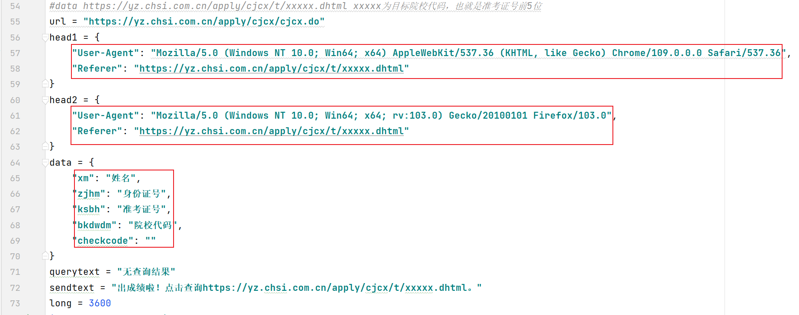
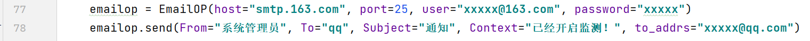
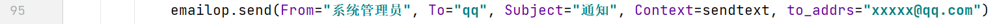
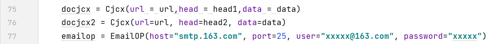
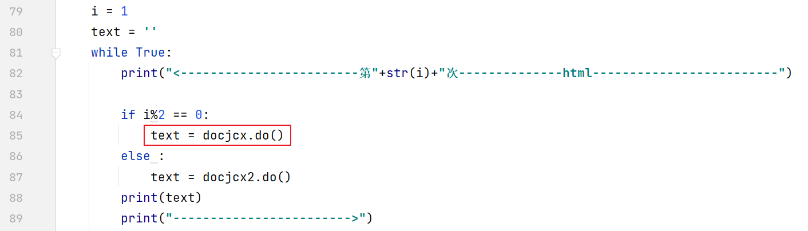
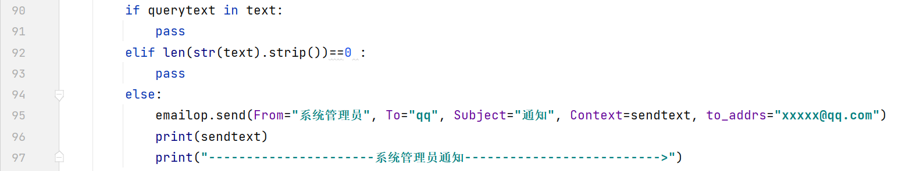
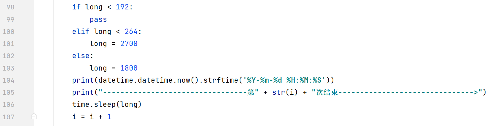
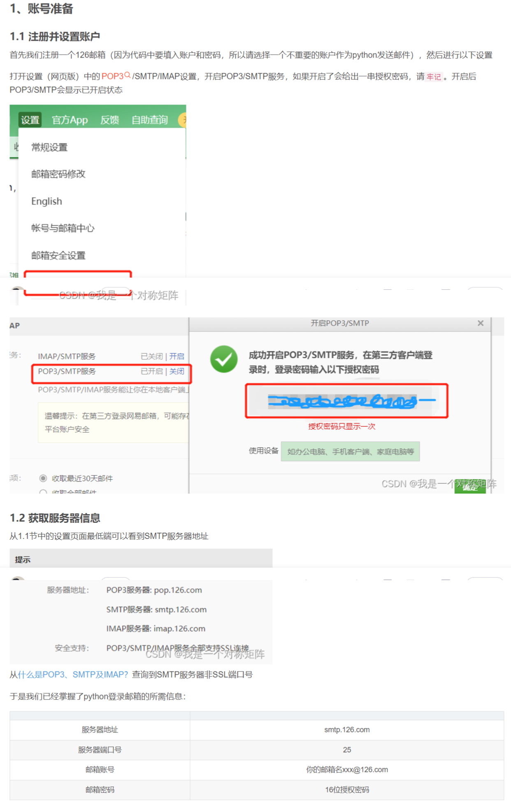

# 成绩查询

这是一个可以部署在服务器上的python代码，可以一直请求目标网页信息，有了目标信息，可以发送邮件到自己邮箱，第一时间知晓。

邮件发送邮件部分借鉴了[这里](https://github.com/thgpddl/CodeHub/blob/main/Tools/email/emailop.py)。

# 1运行教程

必须更改的地方，

## 1.1请求网页

两个head为自己浏览器的信息，为了避免过多重复请求，使用两个不同的浏览器信息。

data信息，修改为自己的信息。

## 1.2发送邮件部分

初始化信息和第一条消息修改为自己的邮箱信息（使用不太重要的邮箱）。操作部分见[这里](https://blog.csdn.net/qq_40243750/article/details/126032582)，文末有博客截图。

正式发送监测信息邮件信息，填写为自己的。

其他部分按需更改。

# 2代码主要运行过程解释

通过两个封装好的class，首先初始化

然后执行请求网页方法，这里通过i的自增，判断奇数偶数来切换两个请求头

判断是否有“无查询结果”字样在网页中，决定是否发出邮件

这一部分，是缩短请求间隔的。

前192次为8天，一小时一次。再过三天，45分钟一次，接着是30分钟一次，以边在最后时间能更频繁地请求页面。

可根据自己的需要更改。

# 3邮箱设置博客截图

