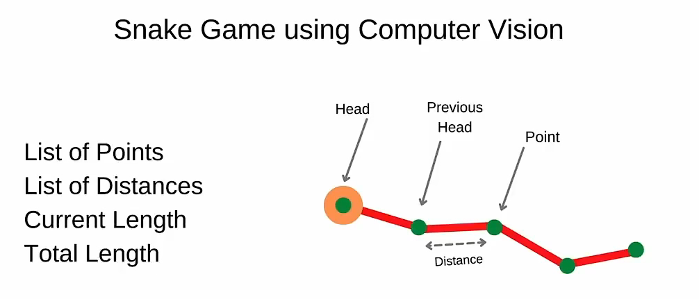
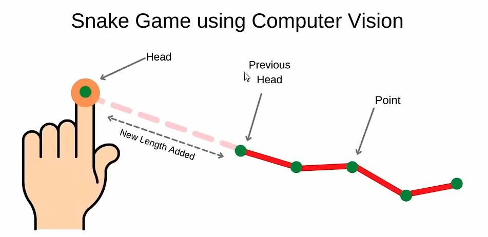
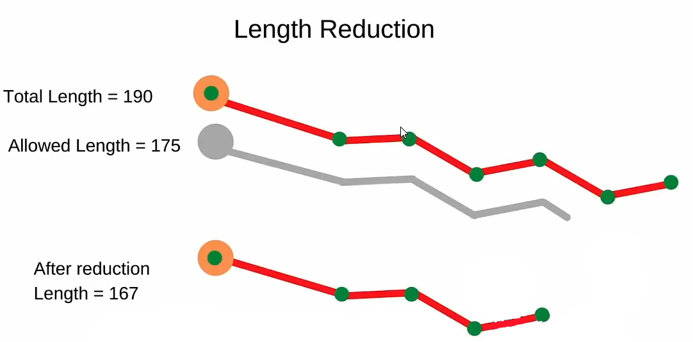
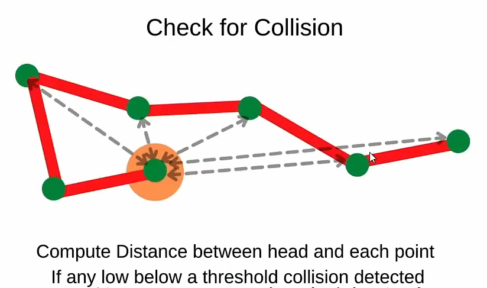

# SnakeGame

本项目在参考了https://b23.tv/dBJlEwJ 和https://blog.csdn.net/qq_44631615/article/details/123270882 ，并且在其中修正了BUG，本项目可以运行！！！

**其中，注释后面带有22的是我具体做出的调整。**

我们看到这个游戏中最主要的SnakeGameClass

## 成员变量

在编写这个类的时候，我们需要有成员变量，在这里，我们需要最基础的几个参数如下

- List Of Points 坐标表

- List Of Distances 距离表

- Current Length 当前长度

- Total Length 允许的总长度

- Head 头部结点坐标

- Previous Head 前一个头部结点坐标

在代码中，具体的变量为

- points 坐标表
- lengths 距离表
- currentLength 当前长度
- allowedLength 允许的总长度
- previousHead 前一个头部结点坐标
- imgFood 食物的图片文件
- hFood 食物图片高度
- wFood 食物图片宽度
- foodPoint 初始化食物坐标
- randomFoodLocation() 随机生成食物的坐标
- score 分数
- gameOver 游戏是否结束

## \__init__()

这个构造函数中，初始化了上述变量。

## update()

这个函数中，会一次又一次地更新新的头部结点和前一个头部结点之间的坐标，接着更新当前长度。

每一次更新了Head的坐标，都会重新计算与Previous Head的距离，并且更新距离表。

### Length Reduction 收缩长度

每一次更新完成之后，都会检查当前长度是否大于允许的总长度。

假如当前长度大于允许的总长度，就会依次去掉末尾的那个结点，直到当前长度在允许的总长度范围内。

### Check if snake ate the food 是否吃了食物

每次都会检查食指的坐标是否在食物的区域内，如果在这个区域内，则会重新生成食物的坐标，并且让分数加一和让允许的长度增加一定长度。

### Draw Snake 画蛇

依次把坐标表用线连起来，但是第一个坐标，也就是Head会更大一点，颜色也会不同。

### Draw Food 画食物

一层一层地覆盖图像，达到更新图片的目的。

### Check for Collision 检查是否缠绕

**这不是最好的方法，但是是最简单的方法。**

首先忽略掉前两个点Head 和 Previous Head，因为他们之间一般不会缠绕，强行计算可能出错。

1. 接下来就是连接，Head和其他的点，并且判断是否会形成一个多边形，也就是形成闭环。
2. 与此同时也会计算Head与各个点之间的最小距离，如果距离的绝对值无限接近于0，则代表接触，形成闭环。

形成闭环，代表着蛇的身体已经缠绕，游戏结束。

## randomFoodLocation()

生成食物的随机坐标。

# 结尾

以上观点不是官方答案，如有错误欢迎指正。
